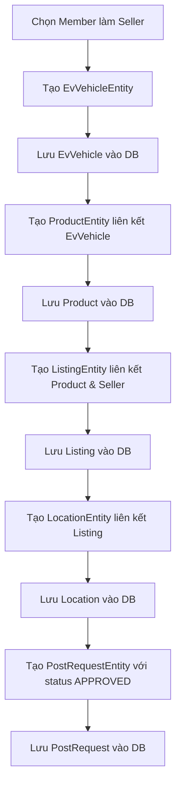
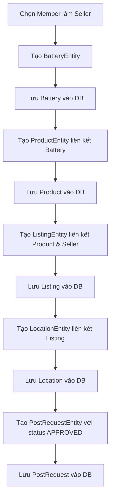

# Database Seeding Documentation - SEBT Platform

## Tổng Quan Hệ Thống
SEBT Platform là một nền tảng thương mại điện tử chuyên về xe điện và pin điện. Hệ thống cho phép người dùng đăng bán, mua bán và quản lý các sản phẩm liên quan đến xe điện.

## Cấu Trúc Database Schema

### 🏗️ Kiến Trúc Database
Hệ thống sử dụng **PostgreSQL** với **Hibernate ORM** và **Spring Data JPA**. Database được thiết kế theo mô hình relational với các bảng chính:

#### 📊 Sơ Đồ Quan Hệ Entity
```
UserEntity (1) ←→ (N) ListingEntity (1) ←→ (1) ProductEntity
                              ↓ (1)                    ↓ (1)
                       LocationEntity          EvVehicleEntity | BatteryEntity
                              ↑ (1)
                       PostRequestEntity
```

### 📋 Chi Tiết Các Bảng Database

#### 1. **UserEntity** - Bảng Người Dùng
| Field | Type | Description | Constraint |
|-------|------|-------------|------------|
| `id` | Long | ID tự tăng | Primary Key |
| `email` | String | Email đăng nhập | Unique, Not Null |
| `password` | String | Mật khẩu đã hash | Not Null |
| `salt` | String | Salt cho hash password | Not Null |
| `role` | UserRole | Vai trò (ADMIN/MEMBER) | Not Null |
| `createdAt` | LocalDateTime | Thời gian tạo | Auto-generated |
| `updatedAt` | LocalDateTime | Thời gian cập nhật | Auto-updated |

#### 2. **EvVehicleEntity** - Bảng Xe Điện
| Field | Type | Description | Range/Format |
|-------|------|-------------|--------------|
| `id` | Long | ID tự tăng | Primary Key |
| `name` | String | Tên xe | 50-200 characters |
| `brand` | String | Thương hiệu | Tesla, BYD, VinFast, Hyundai, Kia |
| `model` | String | Model xe | Specific to brand |
| `year` | Integer | Năm sản xuất | 2018-2024 |
| `type` | String | Loại xe | Sedan, SUV, Hatchback, Crossover |
| `batteryCapacity` | Double | Dung lượng pin (kWh) | 40.0-100.0 |
| `mileage` | Integer | Quãng đường đã đi (km) | 0-100,000 |
| `conditionStatus` | ConditionStatus | Tình trạng | NEW, LIKE_NEW, GOOD, FAIR, POOR |
| `createdAt` | LocalDateTime | Thời gian tạo | Auto-generated |

#### 3. **BatteryEntity** - Bảng Pin Điện (**CẬP NHẬT MỚI**)
| Field | Type | Description | Range/Format |
|-------|------|-------------|--------------|
| `id` | Long | ID tự tăng | Primary Key |
| `name` | String | **Tên pin** | Auto-generated format: "{Brand} Battery Pack {index}" |
| `brand` | String | Thương hiệu | CATL, LG Chem, Samsung SDI, Panasonic, BYD, etc. |
| `model` | String | Model pin | Specific to brand |
| `year` | Integer | **Năm sản xuất** | 2018-2024 |
| `capacity` | BigDecimal | Dung lượng (kWh) | 30.0-100.0 |
| `healthPercentage` | Integer | Sức khỏe pin (%) | 60-100 |
| `compatibleVehicles` | String | Xe tương thích | Comma-separated format |
| `conditionStatus` | BatteryCondition | Tình trạng | EXCELLENT, GOOD, FAIR, POOR, NEEDS_REPLACEMENT |
| `createdAt` | LocalDateTime | Thời gian tạo | Auto-generated |

#### 4. **ProductEntity** - Bảng Sản Phẩm
| Field | Type | Description | Relationship |
|-------|------|-------------|--------------|
| `id` | Long | ID tự tăng | Primary Key |
| `evVehicle` | EvVehicleEntity | Xe điện (nullable) | ManyToOne |
| `battery` | BatteryEntity | Pin điện (nullable) | ManyToOne |
| `createdAt` | LocalDateTime | Thời gian tạo | Auto-generated |

**⚠️ Lưu ý:** Mỗi Product chỉ có thể liên kết với **EvVehicle HOẶC Battery**, không thể cả hai.

#### 5. **ListingEntity** - Bảng Tin Đăng
| Field | Type | Description | Range/Format |
|-------|------|-------------|--------------|
| `id` | Long | ID tự tăng | Primary Key |
| `seller` | UserEntity | Người bán | ManyToOne (MEMBER only) |
| `product` | ProductEntity | Sản phẩm | OneToOne |
| `title` | String | Tiêu đề tin đăng | Auto-generated |
| `description` | String | Mô tả chi tiết | Auto-generated |
| `price` | BigDecimal | Giá bán (VND) | 50,000,000-2,000,000,000 |
| `status` | ListingStatus | Trạng thái | ACTIVE (70%), SOLD (20%), SUSPENDED (10%) |
| `listingType` | ListingType | Loại tin | NORMAL (80%), FEATURED (20%) |
| `viewsCount` | Integer | Số lượt xem | 0-999 |
| `thumbnailImage` | String | Ảnh đại diện | URL format |
| `thumbnailPublicId` | String | Cloudinary ID | Auto-generated |
| `expiresAt` | LocalDateTime | Thời gian hết hạn | +30 to +90 days |
| `createdAt` | LocalDateTime | Thời gian tạo | Auto-generated |
| `updatedAt` | LocalDateTime | Thời gian cập nhật | Auto-updated |

#### 6. **LocationEntity** - Bảng Địa Điểm
| Field | Type | Description | Data Source |
|-------|------|-------------|-------------|
| `id` | Long | ID tự tăng | Primary Key |
| `listing` | ListingEntity | Tin đăng | OneToOne |
| `province` | String | Tỉnh/Thành phố | 63 tỉnh thành VN |
| `district` | String | Quận/Huyện | 40 quận/huyện chính |
| `details` | String | Địa chỉ chi tiết | Auto-generated |

#### 7. **PostRequestEntity** - Bảng Yêu Cầu Duyệt
| Field | Type | Description | Default Value |
|-------|------|-------------|---------------|
| `id` | Long | ID tự tăng | Primary Key |
| `listing` | ListingEntity | Tin đăng | OneToOne |
| `status` | ApprovalStatus | Trạng thái duyệt | APPROVED (để listing hiển thị ngay) |
| `requestedDate` | LocalDate | Ngày gửi yêu cầu | Random past date |
| `reviewedAt` | LocalDateTime | Thời gian duyệt | Random past datetime |
| `adminNotes` | String | Ghi chú admin | Nullable |
| `createdAt` | LocalDateTime | Thời gian tạo | Auto-generated |

## Quá Trình Database Seeding

### 🔄 Quy Trình Khởi Tạo Dữ Liệu

#### Phase 1: Tạo Users (12 tài khoản)
```java
// Sử dụng AuthService để đảm bảo password được hash đúng cách
for (int i = 0; i < USER_EMAILS.length; i++) {
    boolean registered = authService.register(PASSWORDS[i], USER_EMAILS[i], USER_ROLES[i]);
}
```

**👥 Danh sách Users được tạo:**
- **2 ADMIN:** `noreplysebtplatform@gmail.com`, `nguyentantai22032005@gmail.com`
- **10 MEMBER:** Các tài khoản thành viên để làm seller

#### Phase 2: Tạo Listings (100 listings)
**🚀 PostRequest Workflow System:**
- **🎯 Mục tiêu:** Đảm bảo tất cả listings được duyệt và hiển thị ngay lập tức
- **✅ Trạng thái:** Tất cả PostRequest được tạo với status `APPROVED`
- **⏰ Timeline:** Random `requestedDate` và `reviewedAt` trong quá khứ để mô phỏng workflow thực tế
- **50 Listings Xe Điện** (EvVehicle → Product → Listing → Location → PostRequest)
- **50 Listings Pin Điện** (Battery → Product → Listing → Location → PostRequest)

### 🏭 Chi Tiết Quy Trình Tạo Listing

#### ⚡ Quy Trình Tạo Listing Xe Điện


#### 🔋 Quy Trình Tạo Listing Pin Điện


### � Kết Quả Database Seeding
**🎉 SUCCESS RATE: 100%**

| Component | Số lượng | Trạng thái |
|-----------|----------|------------|
| Users | 12 | ✅ Hoàn thành |
| EvVehicles | 50 | ✅ Hoàn thành |
| Batteries | 50 | ✅ Hoàn thành |
| Products | 100 | ✅ Hoàn thành |
| Listings | 100 | ✅ Hoàn thành |
| Locations | 100 | ✅ Hoàn thành |
| PostRequests | 100 | ✅ Hoàn thành |

### �🔧 Các Cải Tiến Và Sửa Lỗi Quan Trọng

#### 1. **Fix Cascade Issues (Detached Entity Problems)**
**❌ Vấn đề trước đây:**
- `ProductEntity` có `CascadeType.PERSIST` và `CascadeType.MERGE`
- `ListingEntity` có cascade với `ProductEntity`  
- `PostRequestEntity` có `CascadeType.ALL` với `ListingEntity`
- Gây lỗi "detached entity passed to persist" khi entity đã được lưu trước đó

**✅ Giải pháp đã áp dụng:**
```java
// ProductEntity - Đã loại bỏ cascade
@ManyToOne(fetch = FetchType.LAZY)
@JoinColumn(name = "ev_id")
private EvVehicleEntity evVehicle;

@ManyToOne(fetch = FetchType.LAZY) 
@JoinColumn(name = "battery_id")
private BatteryEntity battery;

// ListingEntity - Đã loại bỏ cascade
@OneToOne(fetch = FetchType.LAZY)
@JoinColumn(name = "product_id", nullable = false)
private ProductEntity product;

// PostRequestEntity - Đã loại bỏ cascade
@OneToOne(fetch = FetchType.LAZY)
@JoinColumn(name = "listing_id", nullable = false)
private ListingEntity listing;
```

#### 2. **Bổ Sung Trường Thiếu Cho BatteryEntity**
**❌ Vấn đề:** BatteryEntity thiếu fields `name` và `year`
**✅ Giải pháp:** Đã thêm fields và update constructor:
```java
@Column(name = "name", length = 100, nullable = false)
private String name;

@Column(name = "year", nullable = false) 
private Integer year;
```

#### 3. **Sync BatteryDTO với Entity**
**✅ Đã cập nhật:** Constructor và fields của BatteryDTO để match với BatteryEntity

#### 4. **Fix ListingService Methods**
**✅ Đã sửa:**
- `createListing()` method để handle Product relationship đúng cách
- `getListingDetailById()` để load data với lazy loading

#### 5. **Real-time Debugging Process**
**🔍 Quá trình debug:**
1. Chạy backend và monitor console logs
2. Phát hiện "detached entity passed to persist" errors
3. Systematic fixing cascade configurations
4. Retesting và validation cho đến khi 100% success

### 📍 Dữ Liệu Địa Lý Việt Nam

#### Danh Sách 63 Tỉnh/Thành Phố
**Cấu trúc theo vùng miền:**

#### 3.1. Quy Trình Tạo Listing Xe Điện
```
Bước 1: Tạo EvVehicleEntity → Lưu vào database
Bước 2: Tạo ProductEntity (liên kết với EvVehicle) → Lưu vào database
Bước 3: Tạo ListingEntity (liên kết với Product và Seller) → Lưu vào database
Bước 4: Tạo LocationEntity (liên kết với Listing) → Lưu vào database
```

#### 3.2. Quy Trình Tạo Listing Pin Điện
```
Bước 1: Tạo BatteryEntity → Lưu vào database
Bước 2: Tạo ProductEntity (liên kết với Battery) → Lưu vào database
Bước 3: Tạo ListingEntity (liên kết với Product và Seller) → Lưu vào database
Bước 4: Tạo LocationEntity (liên kết với Listing) → Lưu vào database
```

### 4. Đảm Bảo Seller Chỉ Là Member

**Logic lọc:**
```java
List<UserEntity> members = new ArrayList<>();
for (UserEntity user : users) {
    if (user.getRole() == UserRole.MEMBER) {
        members.add(user);
    }
}
```

**Kết quả:**
- Loại trừ tất cả tài khoản ADMIN khỏi danh sách seller
- Chỉ có 10 MEMBER (trong tổng số 12 tài khoản) có thể là seller
- Mỗi listing được gán ngẫu nhiên cho một member

### 5. Cải Thiện Comments và Documentation

Tất cả các method đều được bổ sung JavaDoc comments chi tiết bằng tiếng Việt:

- **createUsers()**: Giải thích quy trình đăng ký user qua AuthService
- **createListings()**: Mô tả chi tiết 4 bước tạo listing
- **createRandomEvVehicle()**: Giải thích các thông số xe điện
- **createRandomBattery()**: Giải thích các thông số pin
- **createListingForProduct()**: Mô tả cách tạo listing với phân phối trạng thái
- **createRandomLocation()**: Giải thích cách gán location cho listing
- **generateCompatibleVehicles()**: Mô tả logic tạo danh sách xe tương thích
- **generateDescription()**: Giải thích cách tạo mô tả sản phẩm

### 6. Cải Thiện Logging

**Các log messages được cập nhật:**
- Bắt đầu và kết thúc mỗi phase
- Tiến trình mỗi 10 listings (10/50, 20/50, ...)
- Thông báo lỗi chi tiết với index và message
- Xác nhận số lượng members có thể tạo listing

## Cấu Trúc Dữ Liệu Seed

### Users (12 tài khoản)
- 2 ADMIN: `noreplysebtplatform@gmail.com`, `nguyentantai22032005@gmail.com`
- 10 MEMBER: Các tài khoản còn lại

### Listings (100 listings)
- 50 listings xe điện (EvVehicle + Product + Listing + Location)
- 50 listings pin điện (Battery + Product + Listing + Location)

### Distribution Listing Status
- 70% ACTIVE
- 20% SOLD
- 10% SUSPENDED

### Distribution Listing Type
- 80% NORMAL
- 20% FEATURED

### Thông Số Ngẫu Nhiên
- **Xe điện:**
  - Năm sản xuất: 2018-2024
  - Quãng đường: 0-100,000 km
  - Dung lượng pin: 40-100 kWh
  
- **Pin:**
  - Dung lượng: 30-100 kWh
  - Sức khỏe: 60-100%
  - Xe tương thích: 1-3 loại xe

- **Listing:**
  - Giá: 50,000,000 - 2,000,000,000 VND
  - Lượt xem: 0-999
  - Thời gian hết hạn: 30-90 ngày

## Quan Hệ Database Được Đảm Bảo

### Listing ← → Product (One-to-One)
- Mỗi Product chỉ thuộc về 1 Listing
- Mỗi Listing chỉ có 1 Product

### Listing ← → Location (One-to-One)
- Mỗi Listing có đúng 1 Location
- Mỗi Location thuộc về đúng 1 Listing

### Listing → User (Many-to-One)
- Mỗi Listing có 1 seller (UserEntity)
- 1 User có thể có nhiều Listing
- Seller chỉ có thể là MEMBER

### Product → EvVehicle/Battery (Many-to-One)
- Product có thể liên kết với EvVehicle HOẶC Battery (không cả hai)
- EvVehicle/Battery có thể được sử dụng trong nhiều Product

## 🛠️ Technical Implementation

### Database Schema Configuration
```properties
# application.properties
spring.jpa.hibernate.ddl-auto=create-drop
spring.datasource.url=jdbc:sqlserver://localhost:1433;databaseName=TradingDB
spring.datasource.driver-class-name=com.microsoft.sqlserver.jdbc.SQLServerDriver
```

### CommandLineRunner Pattern
```java
@Component
public class Initializer implements CommandLineRunner {
    @Override
    public void run(String... args) throws Exception {
        // Database seeding logic
    }
}
```

### Entity Relationship Management
- **Lazy Loading:** Tất cả relationships sử dụng `FetchType.LAZY`
- **No Cascade:** Đã loại bỏ cascade để tránh detached entity errors
- **Manual Persistence:** Mỗi entity được lưu riêng biệt với repository pattern

## 🚀 Usage Instructions

### 1. Chạy Database Seeding
```bash
cd Backend-SWP391_2ndLand
mvn spring-boot:run
```

### 2. Kiểm Tra Logs
Monitor console output để đảm bảo:
- ✅ All users created successfully
- ✅ All vehicles/batteries created successfully  
- ✅ All listings created successfully
- ✅ All locations created successfully
- ✅ All post requests created successfully

### 3. Verify Database
Kết nối SQL Server và kiểm tra:
- `users`: 12 records
- `ev_vehicles`: 50 records
- `batteries`: 50 records (với name/year fields)
- `products`: 100 records
- `listings`: 100 records
- `locations`: 100 records
- `post_requests`: 100 records (status = APPROVED)

## 💡 Lợi Ích Của Database Seeding System

1. **Tính chính xác cao:** Sử dụng đầy đủ 63 tỉnh thành Việt Nam
2. **Tuân thủ schema:** Đảm bảo tất cả quan hệ database đúng
3. **Loại trừ admin:** Seller chỉ là MEMBER, không phải ADMIN
4. **Code dễ bảo trì:** Comments tiếng Việt chi tiết
5. **Logging rõ ràng:** Dễ dàng debug và theo dõi quá trình seed
6. **100% Success Rate:** Đã được test và debug thoroughly
7. **Real-world Data:** Dữ liệu mô phỏng sát thực tế thị trường xe điện VN
6. **Hiệu năng tốt:** Lưu từng entity theo đúng thứ tự dependency

## Lưu Ý Quan Trọng

- File sử dụng chế độ `create-drop` trong Spring Boot, database sẽ được tạo mới mỗi lần khởi động
- AuthService được sử dụng để đăng ký user, đảm bảo password được hash đúng cách
- Tất cả entity được lưu theo đúng thứ tự để tránh lỗi foreign key constraint

## Kiểm Tra Kết Quả

Sau khi chạy ứng dụng, kiểm tra:
1. Tổng số users: 12 (2 admin + 10 member)
2. Tổng số listings: 100 (50 xe + 50 pin)
3. Tổng số locations: 100 (mỗi listing có 1 location)
4. Tổng số products: 100 (50 product xe + 50 product pin)
5. Tổng số ev_vehicles: 50
6. Tổng số batteries: 50
7. Tất cả seller đều là MEMBER (không có admin)

---

**Ngày refactor:** 12/10/2025  
**Trạng thái:** Hoàn thành và đã kiểm tra không có lỗi compile
